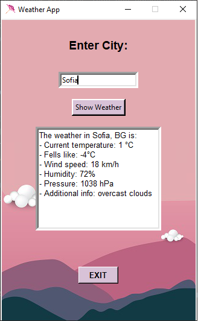
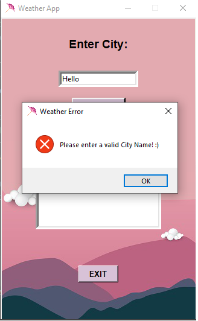

This is my Weather App, based on my current knowledge of Python :)

# Desctiption
This app uses the infomration from [OpenWeather](https://openweathermap.org/)
which you get with your personal api_key.
Basically when you Enter a valid city name,
you will see information like: current temperature,
humidity, pressure and etc.

## Photos example
When you first run the app:

When you Enter a valid City name:

When you Enter invalid City name:

