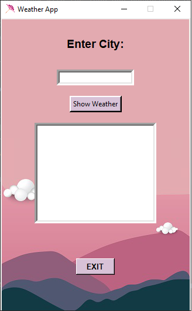

This is a Weather App!.

A small project made by me. This is my first project based on my knowledge of Python
which I started learning in [SoftUni](https://softuni.bg/),
[Programming Fundamentals with Python - September2022](https://softuni.bg/trainings/3840/programming-fundamentals-with-python-september-2022)

This app uses the infomration from [OpenWeather](https://openweathermap.org/)
which you get with your personal api_key.
Basically when you Enter a valid city name,
you will see iformation like: current temperature,
humidity, pressure and etc.

Example of the Weather App:

